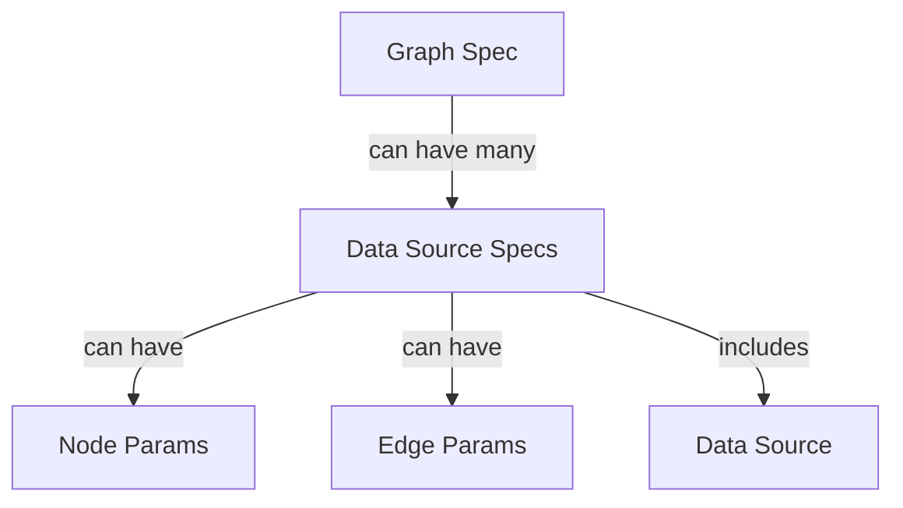

# Concepts

HeXtractor is built upon several core concepts that enable the efficient transformation of tabular data into heterogeneous graphs. These concepts are crucial for understanding how the tool operates and how it can be effectively utilized in various research and practical applications.

## Graph Specifications and Relationships

A Graph Specification (Graph Spec) in HeXtractor can encompass multiple Data Source Specifications (Data Source Specs). Each Data Source Spec can include Node Parameters (Node Params), Edge Parameters (Edge Params), and the data source itself. This hierarchical structure allows for flexible and comprehensive graph construction from diverse data sources.

Consider a single graph that includes one data source specification: a data frame. This data frame consists of two types of nodes: `employee` and `company`. Specific columns in the data frame serve as attributes for each node type. For instance, `employee` attributes might include `employee_occupation`, `employee_age`, and `employee_promotion`, while `company` attributes might include `company_employees` and `company_revenue`. The relationship between these nodes is defined as `company --employs--> employee`, which is established using the `company_id` and `employee_id` columns.

This example demonstrates the flexibility and precision of HeXtractor in transforming tabular data into a structured heterogeneous graph, facilitating advanced data analysis and visualization.

### Mermaid Diagram

The following mermaid diagram illustrates the relationships between Graph Spec, Data Source Specs, Node Params, and Edge Params:



## Tabular Data to Heterogeneous Graphs

The primary function of HeXtractor is to convert tabular data into heterogeneous graphs. This process involves identifying unique entities and relationships within the data and representing them as nodes and edges in a graph. The tool handles both single-table and multi-table data cases, ensuring flexibility and adaptability to different data structures.

### Single-Table Data Case

In the single-table data case, all data is contained within a single table. Each row represents a relationship between entities, which may result in duplication of entities across rows. HeXtractor de-duplicates the data, extracting only unique entities and their relationships. This process involves defining node and edge parameters to specify how entities and relationships are constructed.

### Multi-Table Data Case

In the multi-table data case, data is distributed across multiple tables, each representing a different entity type. This is typical of relational databases or normalized data warehouses. HeXtractor extracts graphs from such data by defining node and edge parameters for each table separately. Multiple data source specifications are used to construct a comprehensive graph from the distributed data.

## Graph Specifications

Graph specifications are central to the operation of HeXtractor. They instruct the tool on how to construct each entity and relationship within the graph. The specifications include:

1. **Node Type Parameters**: Define how to build specific, unique nodes (e.g., companies, employees).
2. **Edge Type Parameters**: Define how to build specific, unique edges (e.g., company-employee relationships).
3. **Data Source Specifications**: Contain multiple node and edge type parameters, specifying the types of entities and relationships that can be found in the data.
4. **Graph Specifications**: Contain multiple data source specifications, guiding HeXtractor in building a single graph from the provided data

## LangChain LLMs integration

HeXtractor can be integrated with LangChain Language Models (LLMs) to enhance the extraction and analysis of structured data from unstructured text. By combining the capabilities of HeXtractor in transforming tabular data into graphs with LangChain's natural language processing capabilities, users can extract valuable insights from a wide range of data sources, including text documents, web pages, and social media content.

In order to turn textual data into heterogeneous graph, the following steps are required:
1. Confugure LLM compatible with `LLMGraphTransformer`.
2. Extract GraphDocument from text.
3. Pass GraphDocument to `convert_graph_document_to_hetero_data(graph_doc)` function.

Example can be found below:

```python
base_url = "YOUR_BASE_URL"
api_key = "YOUR_API_KEY"

llm = ChatOpenAI(base_url=base_url, api_key=api_key)
llm_graph_transformer = LLMGraphTransformer(llm=llm)
```

Example usage:

```python
text = """Filip Wójcik and Marcin Malczewski are data scientists, who developed HeXtractor. It is a library
that helps in extracting heterogeneous knowledge graphs from various data source.
Heterogeneous knowledge graphs are graphs that contain different types of nodes and edges."""

docs = [Document(page_content=text)]

data = await llm_graph_transformer.aconvert_to_graph_documents(docs)

graph_doc = data[0]
convert_graph_document_to_hetero_data(graph_doc)
```

## Example Workflow

An example workflow using HeXtractor involves the following steps:

1. **Load Libraries**: Import necessary libraries and modules.
2. **Prepare Data**: Load and prepare the tabular data.
3. **Define Graph Specifications**: Create node and edge type parameters, data source specifications, and graph specifications.
4. **Extract Graph**: Use HeXtractor to extract the graph based on the defined specifications.
5. **Visualize Graph**: Utilize visualization tools such as NetworkX and PyVis to visualize the extracted graph.

### Detailed Step-by-Step Process

1. **Prepare Tabular Data**: Ensure that the tabular data is in a numerical form. Conversion from text or mixed data to numerical data is a prerequisite for using HeXtractor. Tools like Feature Engine or sklearn preprocessing can be used for this purpose.
2. **Load Libraries**: Import the necessary libraries, including pandas for data manipulation and HeXtractor modules for data extraction.
   ```python
   import pandas as pd
   import hextractor.data_sources as data_sources
   import hextractor.structures as structures
   import hextractor.extraction as hextract
   ```
3. **Load Data**: Load the tabular data into a pandas DataFrame.
   ```python
   df = pd.DataFrame([
       (1, 100, 1000, 0, 0, 25, 0, [1, 2, 3]),
       (1, 100, 1000, 1, 1, 35, 1, [1, 2]),
       (1, 100, 1000, 3, 3, 45, 0, [3, 4]),
       (2, 5000, 100000, 4, 1, 18, 1, [1, 4]),
       (2, 5000, 100000, 5, 1, 20, 1, [1, 1]),
       (2, 5000, 100000, 6, 4, 31, 0, [1, 2]),
   ], columns=[
       "company_id", "company_employees", "company_revenue",
       "employee_id", "employee_occupation", "employee_age",
       "employee_promotion", "tags"
   ])
   ```
4. **Define Node and Edge Parameters**: Specify how to construct nodes and edges.
   ```python
   company_node_params = structures.NodeTypeParams(
       node_type_name="company",
       id_col="company_id",
       attributes=("company_employees", "company_revenue"),
       attr_type="float"
   )
   employee_node_params = structures.NodeTypeParams(
       node_type_name="employee",
       id_col="employee_id",
       attributes=("employee_occupation", "employee_age"),
       label_col="employee_promotion",
       attr_type="long"
   )
   company_has_emp_edge_params = structures.EdgeTypeParams(
       edge_type_name="has",
       source_name="company",
       target_name="employee",
       source_id_col="company_id",
       target_id_col="employee_id"
   )
   ```
5. **Create Data Source Specifications**: Combine node and edge parameters into data source specifications.
   ```python
   single_df_specs = data_sources.DataFrameSpecs(
       name="df1",
       node_params=(company_node_params, employee_node_params),
       edge_params=(company_has_emp_edge_params,),
       data_frame=df
   )
   ```
6. **Define Graph Specifications**: Create graph specifications from data source specifications.
   ```python
   graph_specs = data_sources.GraphSpecs(data_sources=(single_df_specs,))
   ```
7. **Extract Graph**: Use HeXtractor to extract the graph.
   ```python
   hetero_g_single_table = hextract.extract_data(graph_specs)
   ```
8. **Visualize Graph**: Utilize visualization tools to visualize the extracted graph.
   ```python
   import networkx as nx
   import pyvis.network as net

   # Visualization code here
   ```

## Visualization

HeXtractor supports the visualization of graphs using NetworkX and PyVis. These tools provide intuitive and interactive representations of the data, allowing users to explore and analyze the structure and relationships within the graph. Visualization is an essential aspect of the workflow, aiding in the interpretation and validation of the extracted graphs.

## Integration with PyTorch Geometric

HeXtractor is designed to integrate seamlessly with PyTorch Geometric, a framework for creating and working with graph neural networks. The generated graphs are compatible with PyTorch Geometric, enabling users to directly utilize them in their GNN models. This integration enhances the efficiency and effectiveness of the research and development process.

## Conclusion

HeXtractor is a powerful tool that automates the conversion of tabular data into heterogeneous graphs. By understanding the core concepts and workflow, users can leverage HeXtractor to streamline their data preprocessing and focus on developing and training their graph neural network models.
