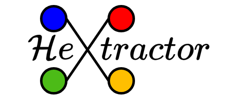

# Introduction

HeXtractor is an advanced tool designed to facilitate the transformation of tabular data into heterogeneous graphs, specifically tailored for use with PyTorch Geometric. As the field of graph neural networks (GNNs) continues to evolve, the significance of heterogeneous graphs becomes increasingly apparent. However, the prevalent format for data remains tabular, necessitating a laborious and error-prone manual conversion process. HeXtractor addresses this challenge by automating the conversion, thereby streamlining the workflow for researchers and practitioners.

## Goals of the Project

The primary objective of HeXtractor is to provide a seamless and efficient method for converting tabular data into heterogeneous graphs. This automation aims to reduce the time and effort required for data preprocessing, allowing users to focus on the development and training of their GNN models. By integrating with PyTorch Geometric, HeXtractor ensures that the generated graphs are immediately usable within this framework, further enhancing the user experience.

## Key Features

1. **Automatic Conversion**: HeXtractor automates the transformation of tabular data into heterogeneous graphs, eliminating the need for manual intervention.
2. **Support for Multiple Formats**: The tool is capable of handling various tabular data formats, ensuring versatility and adaptability.
3. **Integration with PyTorch Geometric**: The generated graphs are compatible with PyTorch Geometric, facilitating seamless integration into existing workflows.
4. **Visualization**: HeXtractor leverages NetworkX and PyVis for the visualization of graphs, providing users with intuitive and interactive representations of their data.

## Why HeXtractor?

Heterogeneous graphs are pivotal in numerous applications of graph neural networks. The manual creation of these graphs from tabular data is often cumbersome and prone to errors. HeXtractor automates this process, enabling researchers to concentrate on model development and training rather than data preprocessing. This automation not only enhances efficiency but also improves the accuracy and reliability of the resulting graphs.

## Technologies

HeXtractor is built using a robust stack of technologies, including:

1. **Python**: The primary programming language used for HeXtractor.
2. **pandas**: Utilized for data manipulation and handling tabular data.
3. **PyTorch Geometric**: A framework for creating and working with graph neural networks.
4. **NetworkX**: Used for creating and managing complex graph structures.
5. **PyVis**: Enables interactive visualization of graphs.

# Installation

## From PyPI

To install the latest version from PyPI run:

```bash
pip install hextractor
```

## From Source Code

You can install HeXtractor from source using either conda or any standard Python virtual environment. We use Poetry as our primary dependency manager because it provides robust dependency resolution, reproducible builds, and better package management.

### Option 1: Using Conda

1. If you prefer Conda for environment management:
```bash
# Create a new conda environment from the provided file
conda env create -f environment.yml


# Activate the environment
conda activate hextractor

# Install poetry inside the conda environment
pip install poetry

# Install the package with all dependencies
poetry install --with dev --with research
```

### Option 2: Using Standard Python Virtual Environment

1. Create and activate a virtual environment using your preferred method:
```bash
# Using venv (Python 3.3+)
python -m venv hextractor-env
source hextractor-env/bin/activate  # On Windows: hextractor-env\Scripts\activate

# Or using virtualenv
virtualenv hextractor-env
source hextractor-env/bin/activate  # On Windows: hextractor-env\Scripts\activate
```

2. Install Poetry and the package:
```bash
# Install poetry
pip install poetry

# Install the package with all dependencies
poetry install --with dev --with research
```

Remember to activate your environment (conda or virtual environment) whenever you want to use HeXtractor.


# Examples

You can find a dedicated package with examples in the `examples` directory. These examples demonstrate the usage of HeXtractor for various datasets and scenarios. Additionally in the `notebooks` directory, you will find Jupyter notebooks that provide detailed walkthroughs of the tool's functionality.
