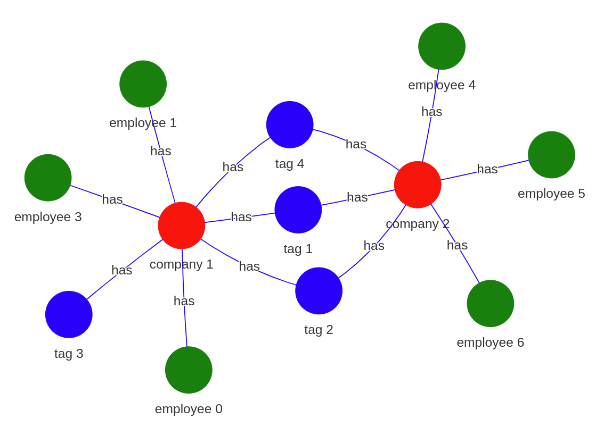
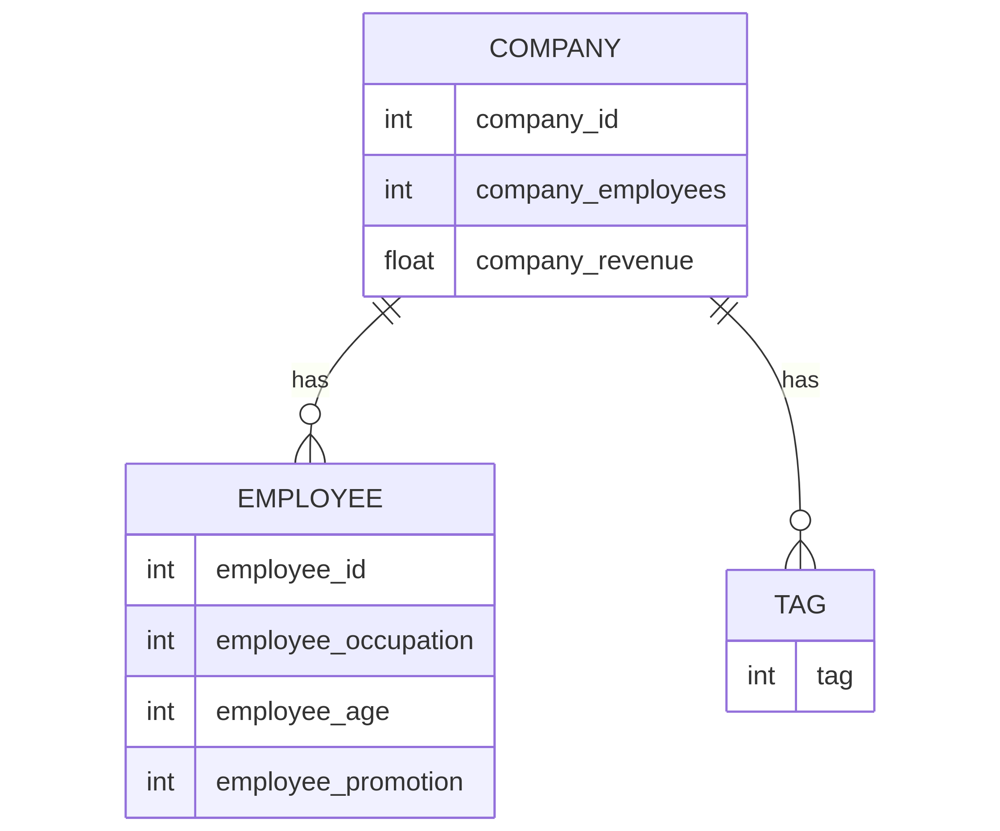
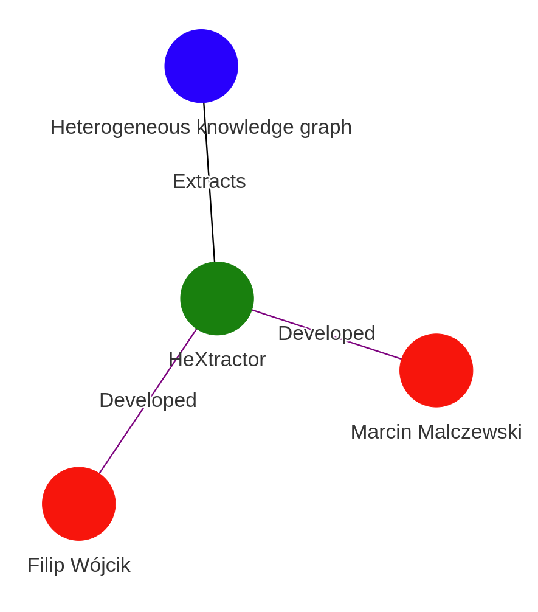

# Summary

HeXtractor is an open-source Python library designed to transform both structured tabular data and unstructured textual content into heterogeneous graph representations suitable for Graph Neural Networks (GNNs). Fully compatible with the PyTorch Geometric (PyG) framework [@Fey_Fast_Graph_Representation_2019], HeXtractor offers a streamlined, high-level interface for defining entities (nodes), relationships (edges), and associated metadata across diverse data modalities.

Graph Neural Networks have gained significant traction due to the rise of the Message Passing Neural Network (MPNN) paradigm [@gilmer2017neural]. Within this context, heterogeneous graphs, which accommodate multiple node and edge types, have emerged as powerful tools in fields such as recommendation systems, fraud detection, and knowledge representation [@Yang2020; @Shi2022]. Modern architectures—including Heterogeneous Graph Transformers [@Hu2020] and Heterogeneous Graph Attention Networks [@Wang2019]—are specifically optimized to exploit the semantic richness of these graph structures.

One prominent application of heterogeneous graphs lies in knowledge graph construction, which models intricate real-world relationships. These structures have found use across various industries, including employment matching [@noy2019industry; @chen2018linkedin] and credit risk evaluation [@mitra2024knowledge].

Despite their versatility, constructing heterogeneous graphs is often time-consuming and error-prone. HeXtractor addresses this challenge by providing a standardized, automated framework to convert structured and unstructured data into formats compatible with GNNs, with optional support for large language models (LLMs) to extract graph structures from text.

# Statement of Need

A heterogeneous graph can be formally represented as a tuple $G = (V, E)$, where $V$ and $E$ denote sets of nodes and edges, respectively. Each node $v \in V$ and edge $e \in E$ is associated with a type mapping: $\phi(v): V \rightarrow A$ and $\Phi(e): E \rightarrow R$, where $A$ and $R$ are sets of node and edge types [@Shi2022]. These structures enable modeling of both structural and semantic diversity inherent in complex datasets.

Although libraries such as PyG [@Fey_Fast_Graph_Representation_2019] and DGL [@wang2019dgl] offer powerful learning tools for heterogeneous graphs, they lack comprehensive support for the graph construction process—especially when dealing with diverse, multi-source datasets. As a result, researchers often resort to custom scripts, introducing inconsistencies and reducing reproducibility.

HeXtractor fills this gap by offering:

- A declarative interface for defining node and edge schemas;
- LLM integration for extracting graph structures from natural language via LangChain-compatible `GraphDocument` objects;
- Schema validation and consistency checking;
- Interactive graph visualization;
- Seamless export to PyG’s `HeteroData` format.

Originally developed as part of the HexGIN project [@Wojcik2024], which focused on financial transaction analysis, HeXtractor has since evolved into a domain-agnostic framework for heterogeneous graph extraction.

# Features and Usage

HeXtractor supports the construction of heterogeneous graphs from both structured tabular datasets and unstructured textual sources. It includes built-in visualization capabilities (via PyVis) and is fully interoperable with the PyTorch Geometric framework.

## Structured Data Extraction

HeXtractor supports both single-table and multi-table data processing. In a single-table mode, each row encodes relationships among entities defined by columns. Users define:

1. Node types and their attributes;
2. Edge definitions among these entities.

This results in a PyG-compatible `HeteroData` object, ready for downstream analysis.

| Company ID | No. employees | Company revenue | Employee ID | Employee position | Employee Age |
|------------|---------------|-----------------|-------------|-------------------|--------------|
| 1          | 100           | 1000            | 0           | 0                 | 25           |
| 1          | 100           | 1000            | 1           | 1                 | 35           |
| ...        | ...           | ...             | ...         | ...               | ...          |
| 2          | 5000          | 100000          | 6           | 4                 | 31           |

Given the exemplary table above, HeXtractor outputs the following heterogeneous graph:

```python
HeteroData(
  company={ x=[3, 2] },
  employee={ x=[7, 2], y=[7] },
  tag={ x=[5] },
  (company, has, employee)={ edge_index=[2, 6] },
  (company, has, tag)={ edge_index=[2, 7] }
)
```

Graph visualization is interactive, with support for customized labels and color schemes to enhance interpretability.

{width=1000px height=1000px}

In **multi-table mode**, users define `GraphSpecs` to merge entity and relationship tables into a unified graph. This approach is well suited for complex data structures with multiple interconnected entities.

For instance, if the dataset from previous table is split into separate `company`, `employee`, and `tags` tables, along with join tables for relationships (as shown in Figure \ref{fig:er_diagram}), HeXtractor will construct an equivalent `HeteroData` object—regardless of the original data layout.

{width=1000px height=1000px}

## Text-Based Graph Extraction

HeXtractor also enables semantic graph construction from natural language, using LLMs via **LangChain**. The process involves:

1. Feeding input text to an LLM;
2. Receiving a `GraphDocument` containing nodes and relationships;
3. Converting it into a `HeteroData` object.

For example, the input:

> Marcin Malczewski and Filip Wójcik are data scientists  
> who developed HeXtractor. It helps in extraction of heterogeneous  
> knowledge graphs from various data sources.

is transformed into the following `HeteroData` object:

```python
HeteroData(
  Person={ x=[2, 1] },
  Library={ x=[1, 1] },
  Graph={ x=[1, 1] },
  (Library, Extracts, Graph)={ edge_index=[2, 1] },
  (Person, Developed, Library)={ edge_index=[2, 2] }
)
```

Next, it can be visualized as in Figure \ref{fig:llm_diagram}.

{width=1000px height=1000px}

This feature can be especially useful for automated document analysis and knowledge graph generation.

# Example Use Cases

HeXtractor is designed to be domain-agnostic and scalable, accommodating datasets of varying size and complexity. Its capabilities are broadly applicable across numerous research and industrial contexts, including:


- Banking and fraud detection [@Johannessen2023; @Wojcik2024]  
- Recommendation systems [@Deng2022; @Wu2022]  
- Biomedical knowledge graphs [@Jumper2021; @maclean2021knowledge]  

In these contexts, HeXtractor facilitates the integration of structured and unstructured data into coherent, semantically enriched graph representations. Without such tooling, this process would typically require extensive manual engineering and be prone to inconsistencies.

# Documentation

Comprehensive documentation, including usage examples and full API reference, is available at: [the official website](https://hextractor.readthedocs.io/en/latest/)

# Acknowledgements

This project did not receive any direct financial support.

# References
